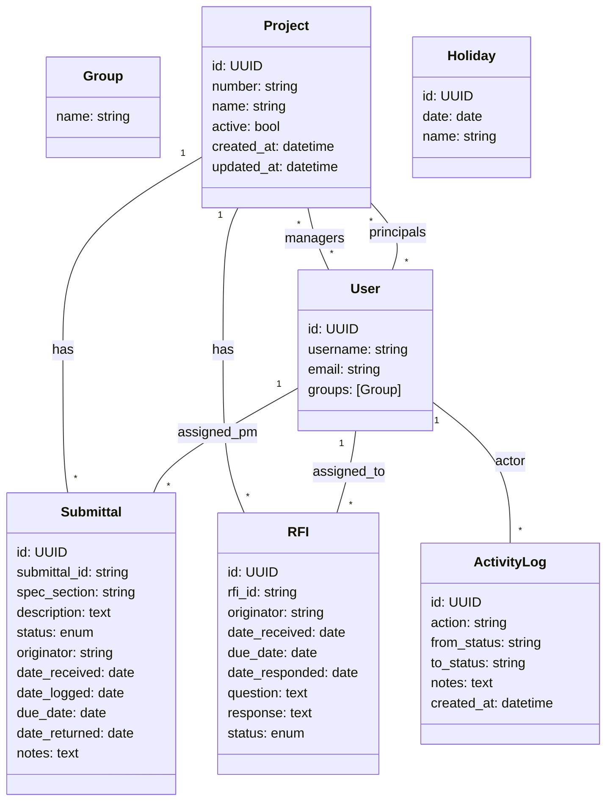

# Data Model & ERD

## Entities

### User
- Uses Django’s built-in `User` plus Group membership for roles: `admin`, `pic`, `pm`.
- Consider a simple `Profile` if custom fields are later required.

### Project
- `id`: UUID (PK)
- `number`: string(10), unique (e.g., `25-001`)
- `name`: string(200)
- `managers`: M2M → User (PMs)
- `principals`: M2M → User (PICs)
- `active`: boolean (default true)
- `created_at`, `updated_at`: timestamps
- Indexes: `number` (unique), `active`

### Submittal
- `id`: UUID (PK)
- `submittal_id`: string, unique (human-readable ID, auto-generated)
- `project`: FK → Project
- `spec_section`: string(20) (e.g., `08 80 00`)
- `description`: text
- `status`: enum {`IN_REVIEW`, `READY_PIC_REVIEW`, `READY_TO_RETURN`, `RETURNED`, `VOID`}
- `assigned_pm`: FK → User (PM)
- `originator`: string(120)
- `date_received`: date
- `date_logged`: date (default today)
- `due_date`: date (auto-calculated: `date_received` + 5 business days)
- `date_returned`: date (nullable)
- `notes`: text (nullable)
- Derived: `is_overdue` (computed: today > `due_date` AND status not in {`RETURNED`, `VOID`})
- Indexes: (`project`, `status`), `due_date`, `assigned_pm`

### RFI
- `id`: UUID (PK)
- `rfi_id`: string, unique (auto-generated)
- `project`: FK → Project
- `assigned_to`: FK → User (PM or PIC)
- `originator`: string(120)
- `date_received`: date
- `due_date`: date (configurable business-day offset; default 5)
- `date_responded`: date (nullable)
- `question`: text
- `response`: text (nullable)
- `status`: enum {`OPEN`, `AWAITING_RESPONSE`, `CLOSED`}
- Indexes: (`project`, `status`), `due_date`, `assigned_to`

### Holiday
- `id`: UUID (PK)
- `date`: date (unique)
- `name`: string(120)
- `is_business_day`: boolean (optional override; default false)
- Use to exclude holidays from business-day calculations

### Attachment (optional for MVP)
- `id`: UUID (PK)
- `content_type` + `object_id` (Generic FK) to Project/Submittal/RFI
- `file`: file path/URL
- `filename`: string
- `uploaded_by`: FK → User
- `uploaded_at`: timestamp
- Indexes: `content_type`, `object_id`, `uploaded_at`

### ActivityLog
- `id`: UUID (PK)
- `actor`: FK → User
- `action`: string(50) (e.g., `STATUS_CHANGE`, `ASSIGNMENT_CHANGE`)
- `target_type` + `target_id`: generic target
- `from_status`: string (nullable), `to_status`: string (nullable)
- `notes`: text (nullable)
- `created_at`: timestamp
- Indexes: `target_type`, `target_id`, `created_at`

## ERD (Mermaid)

## Generation & Validation
- ID generation: use UUID PKs; human IDs (`submittal_id`, `rfi_id`) as separate unique fields to preserve readability and flexible formatting
- Business rules validated at the model/service layer (e.g., only Admin can set `VOID`)
- Soft delete: use `active` flags or timestamps for archival instead of hard deletes when appropriate

